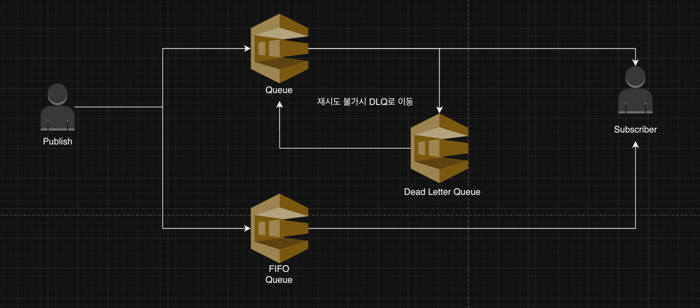

# SQS In Go



## Folders

```sh
    |- infra    ## Terraform
    |- server   ## Server Side Code
```

## Execute

```sh
    cd infra 
    terraform init && terraform apply --auto-approve
```

## Reference 

- <a href="https://docs.aws.amazon.com/ko_kr/code-library/latest/ug/go_2_sqs_code_examples.html"> aws sdk v2 For SQS </a>


